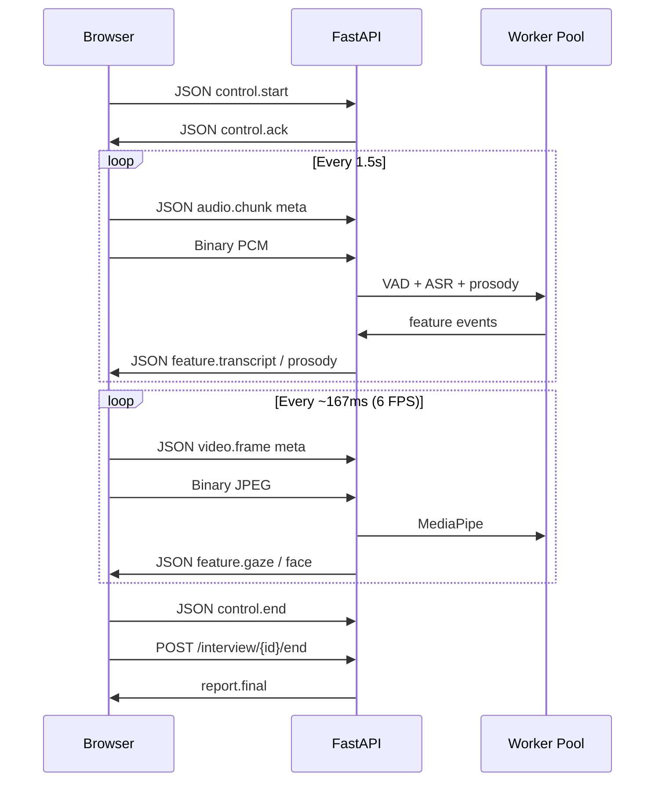

# HireNest Transport Design

## Recommended default: WebSocket (audio chunks + periodic video frames)

| Aspect | WebSocket | WebRTC (aiortc) |
|--------|-----------|-----------------|
| Setup complexity | Low | Higher (ICE, signaling) |
| Latency | Good for 1–2s audio chunks | Lower for continuous streams |
| Windows firewall | Usually fine on localhost | May need TURN for NAT |
| HireNest default | **Yes** | Optional future path |

## WebSocket flow

## Message schemas (control only)

See `backend/app/schemas/websocket.py`.

### Client → Server (text JSON)

- `control.start` — `{ session_id, job_title, consent }`
- `audio.chunk` — `{ session_id, seq, sample_rate, channels, duration_ms, timestamp_ms }`
- `video.frame` — `{ session_id, seq, width, height, format, timestamp_ms }`
- `control.end` — `{ session_id }`

Binary frame follows immediately after `audio.chunk` or `video.frame` metadata.

### Server → Client

- `feature.transcript` — text, timestamps, confidence
- `feature.prosody` — pitch_mean, pitch_std, energy_mean, jitter, shimmer
- `feature.gaze` / `feature.face` — nonverbal metrics
- `interview.followup` — LLM question string
- `report.final` — fused score breakdown (via REST end or WS)

## WebRTC alternative (aiortc)

For production WebRTC:

1. Add `POST /webrtc/offer` and `POST /webrtc/answer` signaling endpoints.
2. Server `RTCPeerConnection` receives audio track → same `AudioWorker` pipeline.
3. Video track sampled at 6 FPS in `on_track` callback.

Not fully implemented in v0.1 — WebSocket path is complete and tested.
